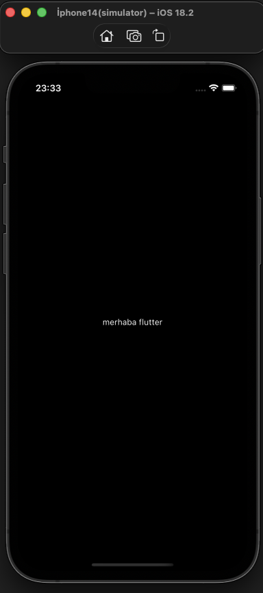

# Öğrenme Notları

Bu depo Flutter öğrenme sürecimin kişisel kaydıdır.
Her commit denediğim, yanlış anladığım veya sonradan kavradığım bir davranışı içerir.

Buradaki amaç bitmiş proje üretmek değil, framework’ün nasıl çalıştığını adım adım anlamaktır.

## Önizleme

## Bu depo hakkında
İlk commitler çoğunlukla kurulum ve düzenleme içerir.
Gerçek öğrenme kayıtları yapı oturduktan sonra başlar.
